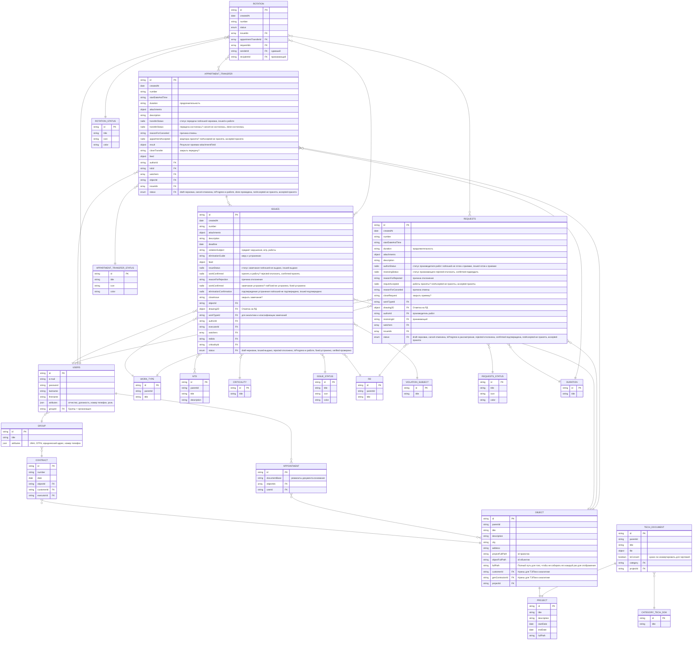

```mermaid
erDiagram
    %% вся модель из Keycloak копируются в справочники, чтобы работали Query. 
    %% роли: Суперадмин, админ, ИСК, исполнитель, наблюдатель
    USERS {
        string id PK
        string e-mail
        string password
        string lastname
        string firstname
        json atributes "отчество, должность, номер телефон, роль" 
        string groupId FK "Группы = организация"
    }
    USERS }o--|| GROUP : ""
    USERS ||--o{ APPOINTMENT : ""


    GROUP {
        string id PK
        string title
        json atributes "ИНН, ОГРН, юридический адрес, номер телефон" 
    }
    GROUP }o--|| CONTRACT : ""
   

    PROJECT {
        string id PK
        string title
        string description
        date startDate
        date endDate
        string fullPath
    }


    %% Здание, трубопровод. Поля не скрываем. 
    OBJECT {
        string id PK
        string parentId 
        string title 
        string description
        string city
        string address
        string projectFullPath "id проектов"
        string objectFullPath "id объектов"
        string fullPath "Полный путь для того, чтобы не собирать его каждый раз для отображения"
        string customerId FK "Нужны для ТЭПов в аналитике"
        string genContractorId FK "Нужны для ТЭПов в аналитике"
        string projectId FK
    }
    OBJECT ||--|| PROJECT : ""
    

    %% Нужен для подтягивания инфы в печатные формы
    CONTRACT {
        string id PK
        string number
        date date
        string objectId FK
        string customerId FK
        string executorId FK 
    }
    CONTRACT }o--|| OBJECT : ""


    APPOINTMENT {
        string id PK
        string documentBase "реквизиты документа-основания"
        array objectIds FK 
        string userId FK 
    }
    APPOINTMENT }o--o{ OBJECT : ""


    TECH_DOCUMENT {
        string id PK
        string parentId
        string title
        object file 
        boolean toConvert "нужно ли конвертировать для чертежей"
        string category FK 
        string projectId FK
    }
    TECH_DOCUMENT }o--|| CATEGORY_TECH_DOK : ""
    TECH_DOCUMENT ||--|| PROJECT : ""


    ISSUES {
        string id PK
        date createdAt
        string number
        object attachments
        string description
        date deadline
        string violationSubject "предмет нарушения, мтр, работы"
        string eliminationGuide "меру к устранению"
        object feed
        radio issueStatus "статус замечания notIssued-не выдано, issued-выдано"
        radio workConfirmed "принять в работу? rejected-отклонить, confirmed-принять"
        string reasonForRejection "причина отклонения"
        radio workConfirmed "замечание устранено? notFixed-не устранено, fixed-устранено"
        radio eliminationConfirmation "подтверждение устранения notIssued-не подтверждено, issued-подтверждено"
        string closeIssue "закрыть замечание?"
        string objectId FK
        object drawing2D FK "Отметка на РД"
        string workTypeId FK "для аналитики и классификации замечаний"
        string authorId FK
        string executorId FK
        array watchers FK
        string ntdIds FK
        string criticalityId FK
        enum status FK "draft-черновик, issued-выдано, rejected-отклонено, inProgress-в работе, fixed-устранено, verified-проверено"
    }
    ISSUES }o--|| USERS : ""
    ISSUES }o--|| WORK_TYPE : ""
    ISSUES }o--o{ NTD : ""
    ISSUES }o--|| CRITICALITY : ""
    ISSUES }o--|| ISSUE_STATUS : ""
    ISSUES }o--|| OBJECT : "" 
    ISSUES }o--|| RD : "" 
    ISSUES }o--|| VIOLATION_SUBJECT : ""


    REQUESTS {
        string id PK
        date createdAt
        string number
        string startDateAndTime
        string duration "продолжительность"
        object attachments
        string description
        radio authorStatus "статус производителя работ notIssued-не готов к приемке, issued-готов к приемке"
        radio receivingStatus "статус принимающего rejected-отклонить, confirmed-подвердить"
        string reasonForRejected "причина отклонения"
        radio requstAccepted "работы приняты? notAccepted-не приняты, accepted-приняты"
        string reasonForCanceled "причина отмены"
        string closeRequest "закрыть приемку?"
        string workTypeId FK
        object drawing2D FK "Отметка на РД"
        string authorId FK "производитель работ"
        string receivingId FK "принимающий"
        array watchers FK
        array issueIds FK
        enum status FK "draft-черновик, cancel-отменена, inProgress-в рассмотрение, rejected-отклонена, confirmed-подтверждена, notAccepted-не принята, accepted-принята"
    }
    REQUESTS }o--|| USERS : ""
    REQUESTS }o--|| WORK_TYPE : ""
    REQUESTS }o--|| REQUESTS_STATUS : ""
    REQUESTS }o--|| OBJECT : "" 
    REQUESTS }o--|| DURATION : ""
    REQUESTS }o--|| RD : "" 


    APPARTMENT_TRANSFER {
        string id PK
        date createdAt
        string number
        string startDateAndTime
        string duration "продолжительность"
        object attachments
        string description
        radio transferStatus "статус передачи notIssued-черновик, issued-в работе"
        radio transferStatus "передача состоялась? cancel-не состоялась, done-состоялась"
        string reasonForCanceled "причина отмены"
        radio appartmentAccepted "квартира принята? notAccepted-не принята, accepted-принята"
        object result "Результат приемки-attachmentField"
        string closeTransfer "закрыть передачу?"
        object feed
        string authorId FK
        string iskId FK
        array watchers FK
        string objectId FK
        array issueIds FK
        enum status FK "draft-черновик, cancel-отменена, inProgress-в работе, done-проведена, notAccepted-не принята, accepted-принята"
    }
    APPARTMENT_TRANSFER }o--|| USERS : ""
    APPARTMENT_TRANSFER ||--o{ ISSUES : ""
    APPARTMENT_TRANSFER }o--|| APPARTMENT_TRANSFER_STATUS : ""
    APPARTMENT_TRANSFER }o--|| OBJECT : "" 
    APPARTMENT_TRANSFER }o--|| DURATION : ""
    

    ROTATION {
        string id PK
        date createdAt
        string number
        enum status
        array issueIds FK
        array appartmentTransferId FK
        array requestIds FK
        string senderId FK "сдаюший"
        string recipientId FK "принимающий"
    }
    ROTATION }o--o{ ISSUES : ""
    ROTATION }o--o{ REQUESTS : ""
    ROTATION }o--o{ APPARTMENT_TRANSFER : ""
    ROTATION }o--|| USERS : ""
    ROTATION }o--|| ROTATION_STATUS : ""


    WORK_TYPE {
        string id PK
        string parentId 
        string title
    }


    NTD {
        string id PK
        string parentId 
        string title
        string description
    }


    CRITICALITY {
        string id PK
        string title
    }


    ISSUE_STATUS {
        string id PK
        string title
        string icon
        string color
    }


    REQUESTS_STATUS {
        string id PK
        string title
        string icon
        string color
    }


    APPARTMENT_TRANSFER_STATUS {
        string id PK
        string title
        string icon
        string color
    }


    ROTATION_STATUS {
        string id PK
        string title
        string icon
        string color
    }


    CATEGORY_TECH_DOK {
        string id PK
        string title
    }


    VIOLATION_SUBJECT {
        string id PK
        string title
    }


    DURATION {
        string id PK
        string title
    }


    RD {
        string id PK
        string parentId 
        string title
    }
```