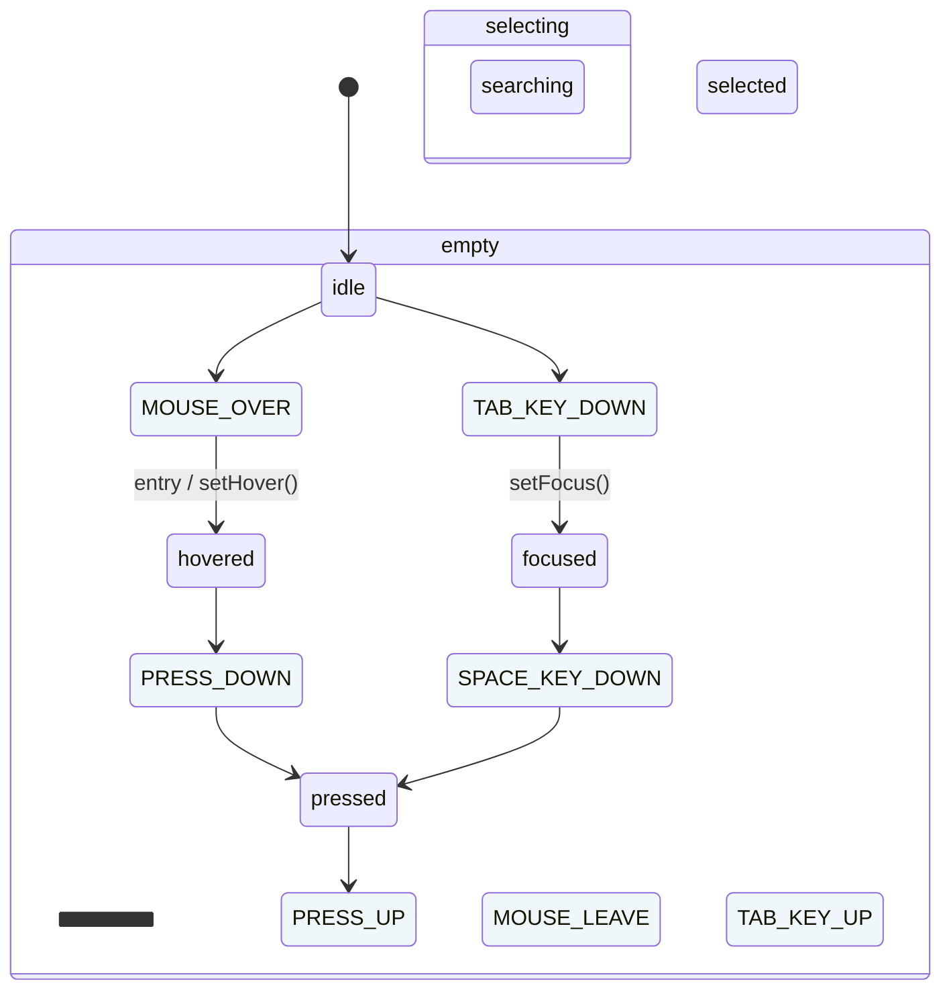

```mermaid
stateDiagram-v2
   classDef trigger fill: lightblue, fill-opacity:0.2,

      [*] --> idle
   state empty {
      state idle_fork <<fork>>
      idle --> MOUSE_OVER
      idle --> TAB_KEY_DOWN
      
      MOUSE_OVER --> hovered : entry / setHover()
      hovered --> PRESS_DOWN
      PRESS_DOWN --> pressed
      pressed --> PRESS_UP
      TAB_KEY_DOWN --> focused: setFocus()
      focused --> SPACE_KEY_DOWN

      SPACE_KEY_DOWN --> pressed

   
      MOUSE_LEAVE
      TAB_KEY_UP
   }
   state selecting {
      searching

   }
   selected

   class MOUSE_OVER,
   PRESS_DOWN,
   PRESS_UP,
   TAB_KEY_DOWN,
   TAB_KEY_UP,
   SPACE_KEY_DOWN,
   MOUSE_LEAVE trigger
```