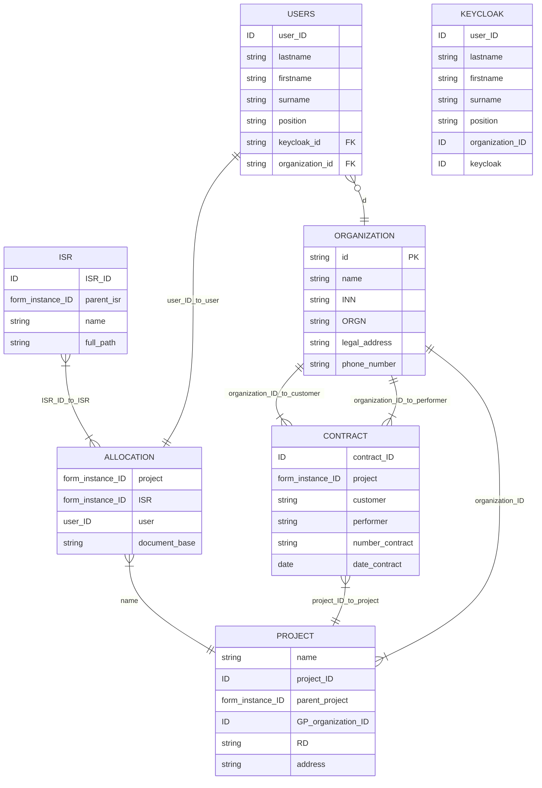

```mermaid
erDiagram
    PROJECT {
        string name
        ID project_ID
        form_instance_ID parent_project
        ID GP_organization_ID
        string RD
        string address 
    }
    ISR many(1) -- many(1) ALLOCATION : ISR_ID_to_ISR
    ISR {
        ID ISR_ID
        form_instance_ID parent_isr
        string name
        string full_path 
    }
    ALLOCATION many(1) -- one PROJECT : name
    ALLOCATION {
        form_instance_ID project
        form_instance_ID ISR
        user_ID user
        string document_base
    }
    CONTRACT many(1) -- one PROJECT : project_ID_to_project
    CONTRACT {
        ID contract_ID
        form_instance_ID project
        string customer
        string performer
        string number_contract
        date date_contract
    }
    ORGANIZATION one -- many(1) CONTRACT : organization_ID_to_customer
    ORGANIZATION one -- many(1) CONTRACT : organization_ID_to_performer
    ORGANIZATION one -- many(1) PROJECT : organization_ID
    ORGANIZATION {
        string id PK
        string name
        string INN
        string ORGN
        string legal_address
        string phone_number
    }
    USERS }o--|| ORGANIZATION : d
    USERS one -- one ALLOCATION : user_ID_to_user
    USERS {
        ID user_ID
        string lastname
        string firstname
        string surname
        string position
        string keycloak_id FK
        string organization_id FK
    }
    KEYCLOAK {
        ID user_ID
        string lastname
        string firstname
        string surname
        string position
        ID organization_ID
        ID keycloak
    }
```