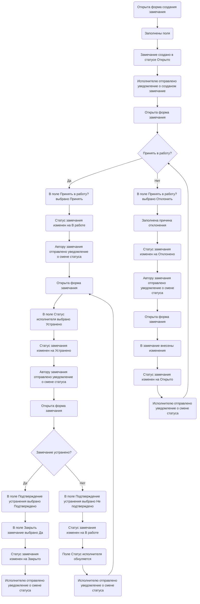

# Flowchart Замечания

```mermaid
flowchart TB
    A(Открыта форма создания замечания) --> B(Заполнены поля)
    B --> C(Замечание создано в статусе Открыто)
    C --> D(Исполнителю отправлено уведомление о созданом замечание)
    D --> D1(Открыта форма замечания)
    D1 --> E{Принять в работу?}
        E --> |Да| F(В поле Принять в работу? выбрано Принять)
            F --> F1(Статус замечания изменен на В работе)
            F1 --> F2(Автору замечания отправлено уведомление о смене статуса)
            F2 --> F3(Открыта форма замечания)
            F3 --> F4(В поле Статус исполнителя выбрано Устранено)
            F4 --> F5(Статус замечания изменен на Устранено)
            F5 --> F6(Автору замечания отправлено уведомление о смене статуса)
            F6 --> F7(Открыта форма замечания)
            F7 --> H{Замечание устранено?}
                H --> |Да| I(В поле Подтверждение устранения выбрано Подтверждено)
                    I --> I1(В поле Закрыть замечание выбрано Да)
                    I1 --> I2(Статус замечания изменен на Закрыто)
                    I2 --> I3(Исполнителю отправлено уведомление о смене статуса)
                H --> |Нет| J(В поле Подтверждение устранения выбрано Не подтверждено)
                    J --> J1(Статус замечания изменен на В работе)
                    J1 --> J2(Поле Статус исполнителя обнуляется)
                    J2 --> J3(Исполнителю отправлено уведомление о смене статуса)
                    J3 --> F3
        E --> |Нет| G(В поле Принять в работу? выбрано Отклонить)
            G --> G1(Заполнена причина отклонения)
            G1 --> G2(Статус замечания изменен на Отклонено)
            G2 --> G3(Автору замечания отправлено <br/> уведомление о смене статуса)
            G3 --> G4(Открыта форма замечания)
            G4 --> G5(В замечание внесены изменения)
            G5 --> G6(Статус замечания изменен на Открыто)
            G6 --> G7("`Исполнителю отправлено уведомление о смене статуса`")
            G7 --> E
```