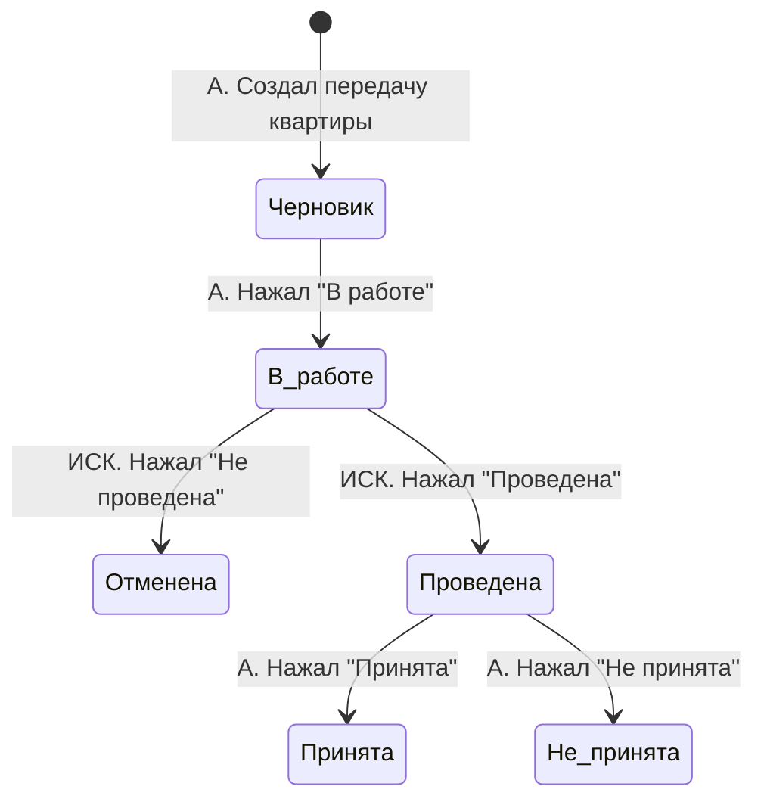
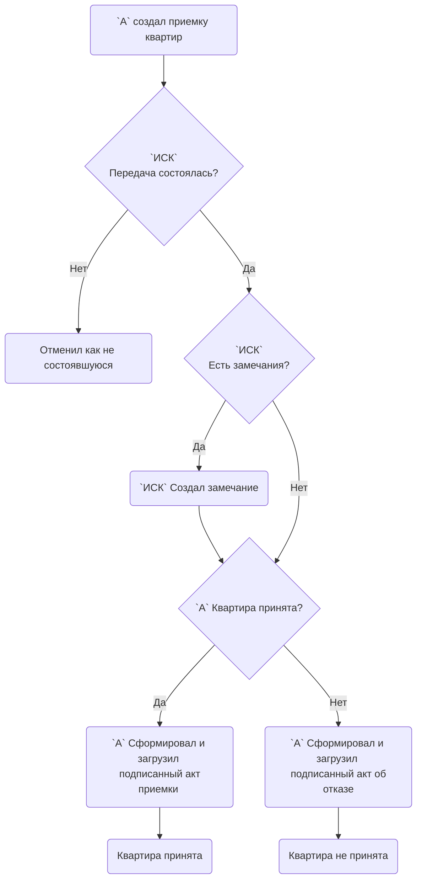
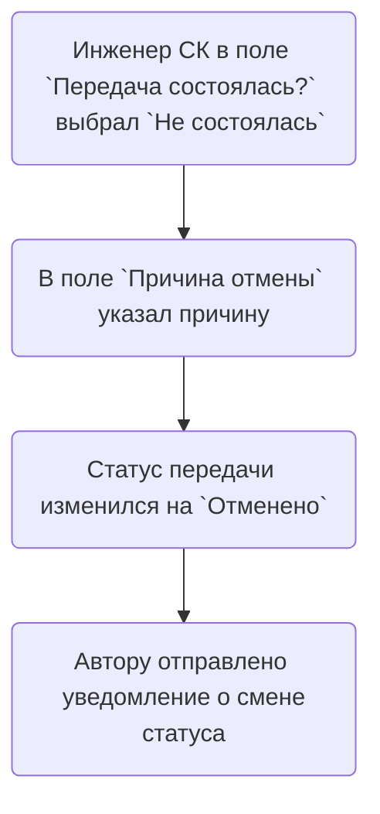
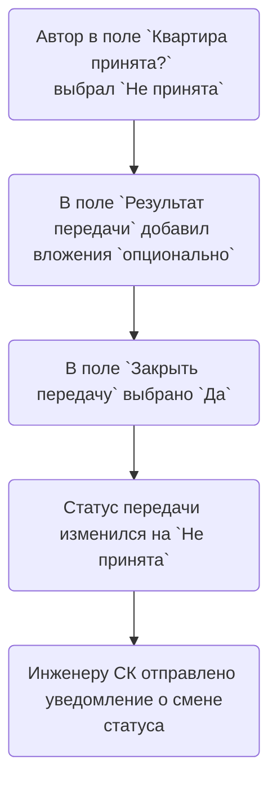
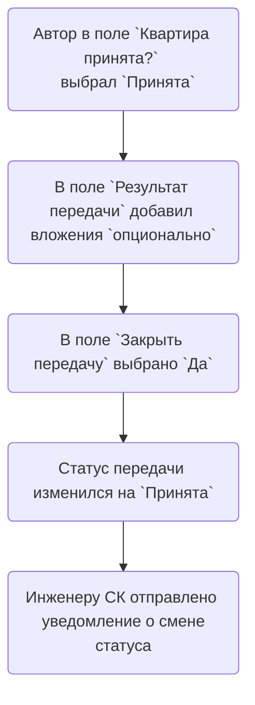

# StateChart Передача квартир
### Аннотация  
А - Автор  
ИСК - Инженер Стройконтроля
 
 

 
 
 
 
 

# Flowchart Передача квартир
### Аннотация  
А - Автор  
ИСК - Инженер Стройконтроля

 
 
 
 
 

# Flowchart Не проведена

 
 

# Flowchart Не принята

 
 

# Flowchart Принята

 
 
