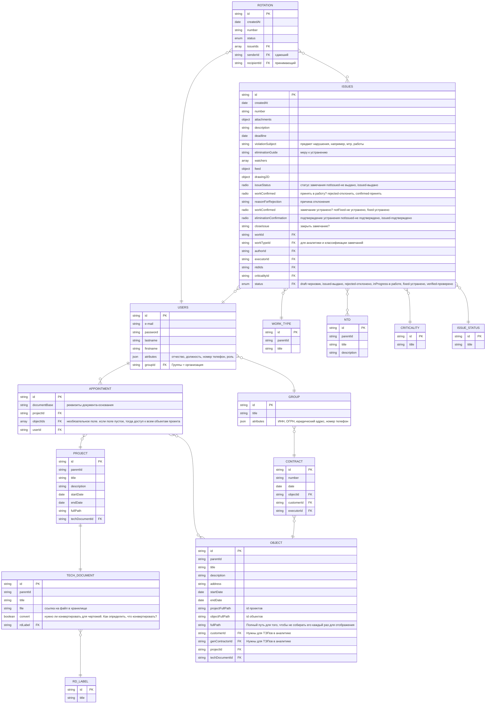

```mermaid
erDiagram
    %% вся модель из Keycloak копируются в справочники, чтобы работали Query. 
    %% роли: Суперадмин, админ, ИСК, исполнитель, наблюдатель
    USERS {
        string id PK
        string e-mail
        string password
        string lastname
        string firstname
        json atributes "отчество, должность, номер телефон, роль" 
        string groupId FK "Группы = организация"
    }
    USERS }o--|| GROUP : ""
    USERS ||--o{ APPOINTMENT : ""


    GROUP {
        string id PK
        string title
        json atributes "ИНН, ОГРН, юридический адрес, номер телефон" 
    }
    GROUP }o--|| CONTRACT : ""
   

    PROJECT {
        string id PK
        string parentId 
        string title
        string description
        date startDate
        date endDate
        string fullPath
        string techDocumentId FK 
    }
    PROJECT ||--|| TECH_DOCUMENT : ""


    %% Здание, трубопровод. Поля не скрываем. 
    OBJECT {
        string id PK
        string parentId 
        string title 
        string description
        string address
        date startDate
        date endDate
        string projectFullPath "id проектов"
        string objectFullPath "id объектов"
        string fullPath "Полный путь для того, чтобы не собирать его каждый раз для отображения"
        string customerId FK "Нужны для ТЭПов в аналитике"
        string genContractorId FK "Нужны для ТЭПов в аналитике"
        string projectId FK
        string techDocumentId FK
    }


    %% Нужен для подтягивания инфы в печатные формы
    CONTRACT {
        string id PK
        string number
        date date
        string objectId FK
        string customerId FK
        string executorId FK 
    }
    CONTRACT }o--|| OBJECT : ""


    APPOINTMENT {
        string id PK
        string documentBase "реквизиты документа-основания"
        string projectId FK
        array objectIds FK "необязательное поле. если поле пустое, тогда доступ к всем объектам проекта"
        string userId FK 
    }
    APPOINTMENT }o--|| PROJECT : ""
    APPOINTMENT }o--o{ OBJECT : ""


    TECH_DOCUMENT {
        string id PK
        string parentId
        string title
        string file "ссылка на файл в хранилище"
        boolean convert "нужно ли конвертировать для чертежей. Как определить, что конвертировать?"
        string rdLabel FK 
    }
    TECH_DOCUMENT }o--|| RD_LABEL : ""


    ISSUES {
        string id PK
        date createdAt
        string number
        object attachments
        string description
        date deadline
        string violationSubject "предмет нарушения, например, мтр, работы"
        string eliminationGuide "меру к устранению"
        array watchers
        object feed
        object drawing2D
        radio issueStatus "статус замечания notIssued-не выдано, issued-выдано"
        radio workConfirmed "принять в работу? rejected-отклонить, confirmed-принять"
        string reasonForRejection "причина отклонения"
        radio workConfirmed "замечание устранено? notFixed-не устранено, fixed-устранено"
        radio eliminationConfirmation "подтверждение устранения notIssued-не подтверждено, issued-подтверждено"
        string closeIssue "закрыть замечание?"
        string workId FK
        string workTypeId FK "для аналитики и классификации замечаний"
        string authorId FK
        string executorId FK
        string ntdIds FK
        string criticalityId FK
        enum status FK "draft-черновик, issued-выдано, rejected-отклонено, inProgress-в работе, fixed-устранено, verified-проверено"
    }
    ISSUES }o--|| USERS : ""
    ISSUES }o--|| WORK_TYPE : ""
    ISSUES }o--o{ NTD : ""
    ISSUES }o--|| CRITICALITY : ""
    ISSUES }o--|| ISSUE_STATUS : ""

  
    ROTATION {
        string id PK
        date createdAt
        string number
        enum status
        array issueIds FK
        string senderId FK "сдаюший"
        string recipientId FK "принимающий"
    }
    ROTATION }o--o{ ISSUES : ""
    ROTATION }o--|| USERS : ""


    WORK_TYPE {
        string id PK
        string parentId 
        string title
    }


    NTD {
        string id PK
        string parentId 
        string title
        string description
    }


    CRITICALITY {
        string id PK
        string title
    }


    ISSUE_STATUS {
        string id PK
        string title
    }


    RD_LABEL {
        string id PK
        string title
    }
```