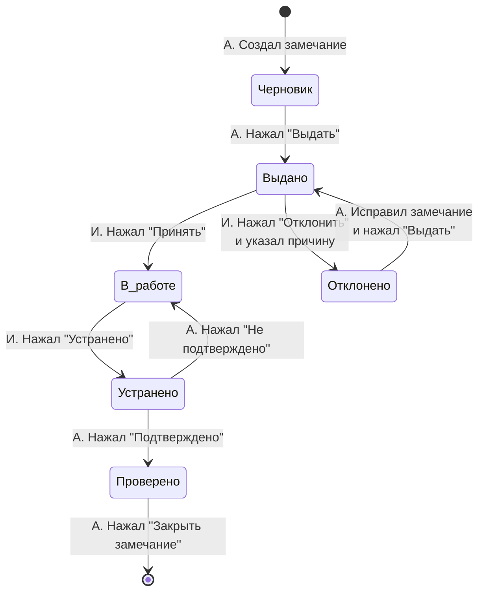
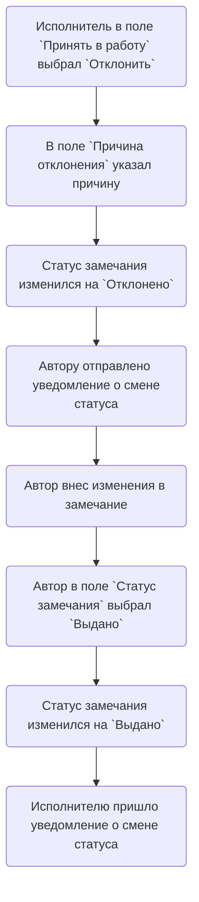
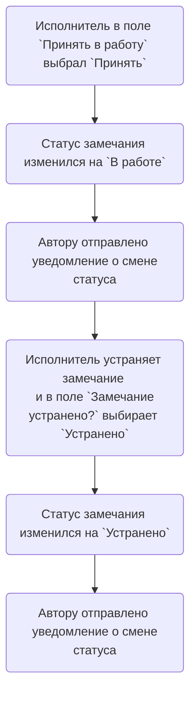
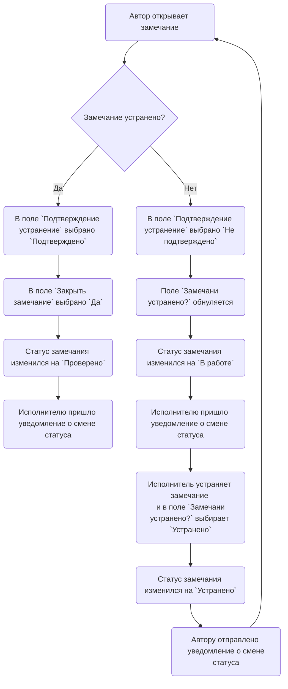
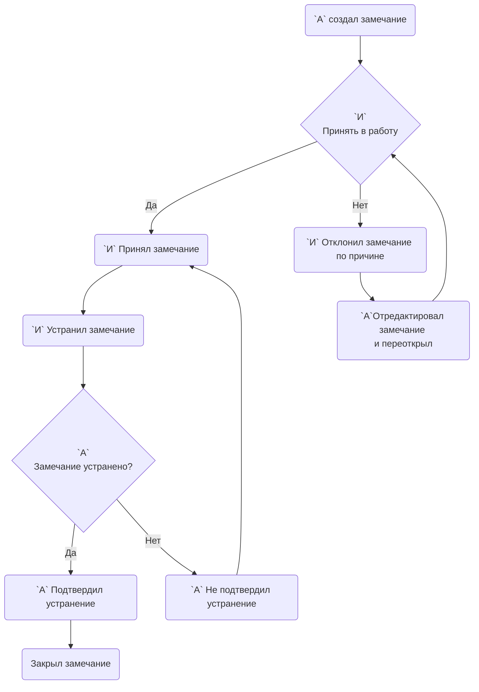

# StateChart Замечания
### Аннотация  
А - автор замечания  
И - исполнитель
 
 

 
 

# Flowchart Отклонить

 
 

# Flowchart Принял и устранил замечание

 
 

# Flowchart Подтверждение устранения

 
 
 
 
 

# Flowchart Замечания
### Аннотация  
А - автор замечания  
И - исполнитель

 
 
 
 
 