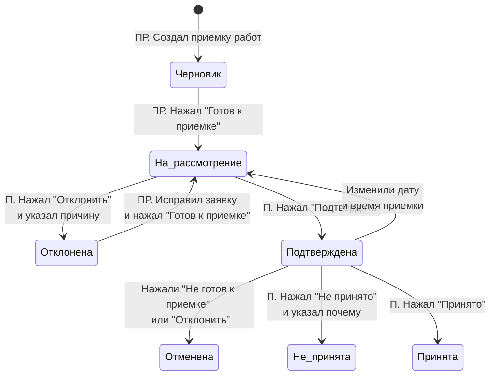

# StateChart Приемка работ
### Аннотация  
ПР - Производитель работ  
П - Принимающий
 
 

```mermaid
    stateDiagram-v2
    [*] --> Черновик: ПР. Создал приемку работ
    Черновик --> На_рассмотрение: ПР. Нажал "Готов к приемке"
    На_рассмотрение --> Отклонена: П. Нажал "Отклонить" <br/> и указал причину
    Отклонена --> На_рассмотрение: ПР. Исправил заявку <br/> и нажал "Готов к приемке"
    На_рассмотрение --> Подтверждена: П. Нажал "Подтвердить"
    Подтверждена --> На_рассмотрение: Изменили дату <br/> и время приемки
    Подтверждена --> Отменена: Нажали "Не готов к приемке" <br/> или "Отклонить"
    Подтверждена --> Не_принята: П. Нажал "Не принято" <br/> и указал почему
    Подтверждена --> Принята: П. Нажал "Принято"
```
 
 
 
 
 

