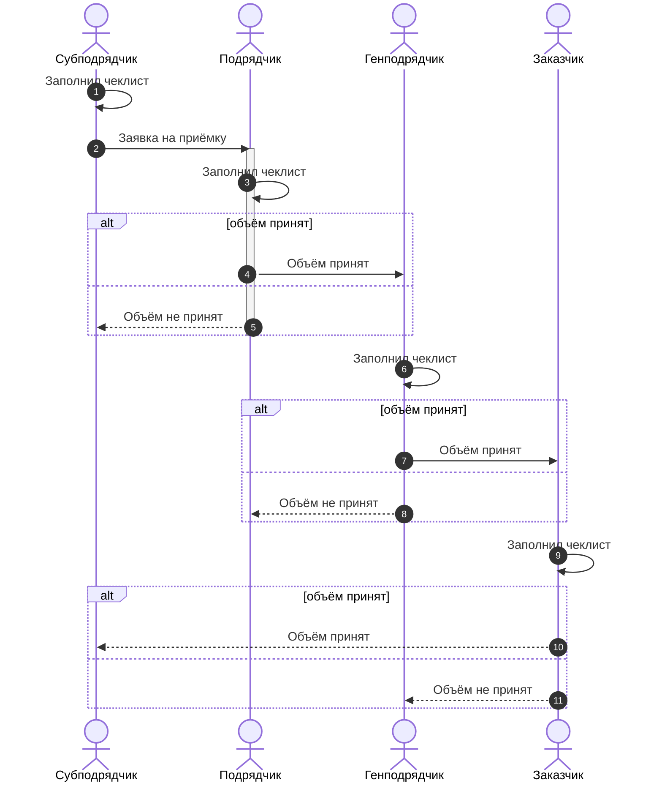

```mermaid
sequenceDiagram
   autonumber

   actor subcontractor as Субподрядчик
   actor contractor as Подрядчик
   actor gencontractor as Генподрядчик
   actor customer as Заказчик

   subcontractor ->> subcontractor: Заполнил чеклист
   subcontractor ->> contractor: Заявка на приёмку
   activate contractor

   contractor ->> contractor: Заполнил чеклист
   alt объём принят
      contractor ->> gencontractor: Объём принят
   else
      contractor -->> subcontractor: Объём не принят
   end
   deactivate contractor
   gencontractor ->> gencontractor: Заполнил чеклист
   alt объём принят
      gencontractor ->> customer: Объём принят
   else
      gencontractor -->> contractor: Объём не принят
   end
   customer ->> customer: Заполнил чеклист
   alt объём принят
      customer -->> subcontractor: Объём принят
   else
      customer -->> gencontractor: Объём не принят
   end
```
