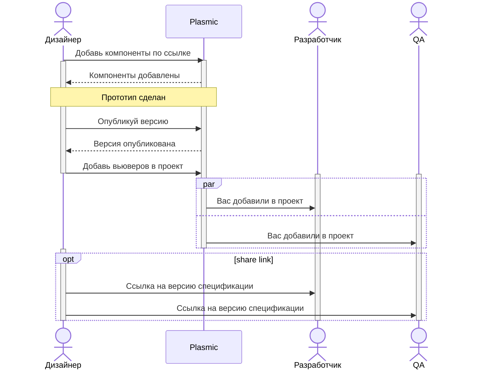
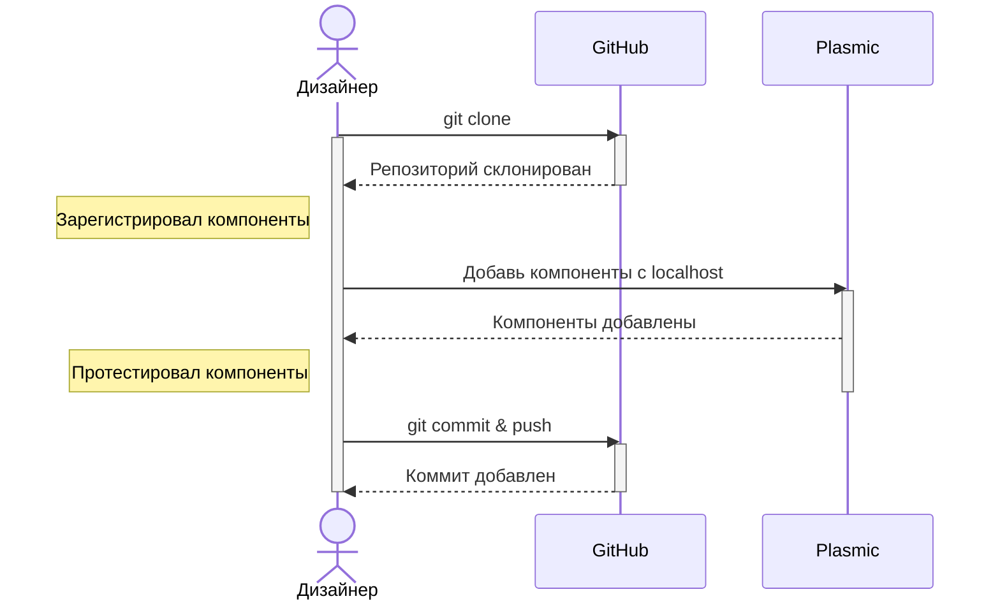

# Работа в Plasmic

[Общий процесс](#общий-процесс)

[Добавление новых кодовых компонентов](#добавление-новых-кодовых-компонентов)

[Изменение темы приложения](#изменение-темы-приложения)

<br/>
<br/>

# Общий процесс



<br />
<br />
<br />

# Добавление новых кодовых компонентов



<br />

Для добавления новых компонентов необходимо:
Скачать репозиторий себе на компьютер с помощью команды:

```
git clone https://github.com/mslizh/design.git
```

Установить необходимые зависимости c помощью команды:

```
npm install
```

В папке `components` создать новую папку с именем регистрируемого компонента. В этой папке создать два файла: `ComponentName.ts` и `index.ts`.

В файле `ComponentName.ts` написать функцию регистрации компонента:

```ts
import ComponentName from "library-name";
import { registerComponent } from "@plasmicapp/host";

export function registerComponentName() {
   registerComponent(ComponentName, {
      name: "ComponentName",
      props: {
         // Указать свойства, которые необходимо вынести в интерфейс Plasmic.
      },
      importPath: "library-name",
   });
}
```

`ComponentName` и `library-name` заменить на название своего компонента и библиотеки, из которой он импортируется.

<br />
<br />

# Изменение темы приложения

В плазмик подключается отдельная тема, которая выступает спецификацией для разработчиков. Если необходимо внести какое-либо изменение в тему можно руководствоваться тем же процессом, что и для [добавления кодовых компонентов](#добавление-новых-кодовых-компонентов). После этого тема передаётся разработчикам, как спецификация, и они вносят изменения в клиентском репозитории.
